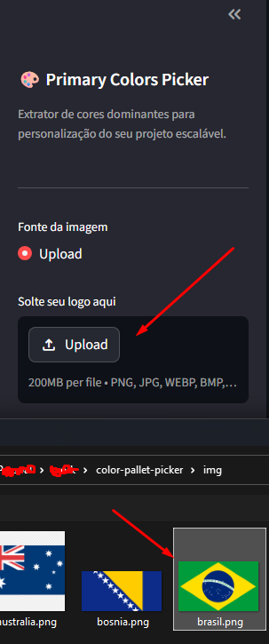
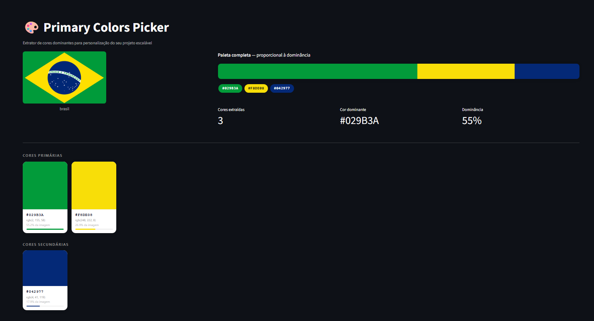

# Primary Colors Picker

Extrai as cores dominantes de qualquer logo e gera paletas prontas para personalização de sistemas em geral — com swatches interativos, cópia de HEX com um clique, exportação em PDF e snippets de código prontos para colar no projeto personalizado com base na logo do cliente.

https://palette-logo-picker.streamlit.app/

---

## Como executar localmente

```bash
# 1. Clonar o repositório
git clone https://github.com/seu-usuario/color-pallet-picker.git
cd color-pallet-picker

# 2. Instalar dependências
pip install -r requirements.txt

# 3. Rodar o app
streamlit run src/app.py
```

Acesso via ´localhost´ 

---

## Como usar

1. Faça upload da logo do cliente (PNG, JPG, WEBP...)
2. Ajuste o número de cores a extrair no slider
3. Visualize as cores agrupadas por dominância (Primárias / Secundárias / Destaque)
4. Clique em qualquer card ou código HEX para copiar para a área de transferência
5. Na seção **Código para projeto**, copie o snippet pronto (CSS, config.toml, Python ou JSON)
6. Exporte o PDF com a paleta completa se necessário


---

## Estrutura do projeto

```
├── src/
│   ├── app.py        # Interface Streamlit (entry point)
│   └── main.py       # Extração de cores (K-means) e geração de PDF
├── img/              # Imagens locais para teste
├── output/           # PDFs gerados (não versionado)
└── requirements.txt
```

---

## Exemplos

Faça upload da logo e o app identifica as cores automaticamente, separando por dominância.



A paleta é exibida com strip proporcional, pills HEX e cards clicáveis — clique em qualquer cor para copiar o código.



Na seção "Código para Projeto", o snippet já vem pronto para colar diretamente no seu projeto Streamlit.


---

## Dependências principais

| Pacote | Uso |
|---|---|
| `Pillow` | Leitura e processamento de imagens |
| `scikit-learn` | K-means para extração de cores dominantes |
| `numpy` | Operações de array sobre pixels |
| `reportlab` | Geração do PDF |
| `streamlit` | Interface web |
